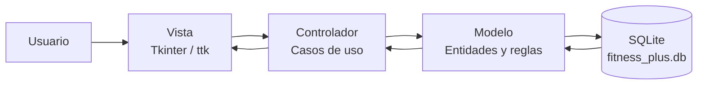
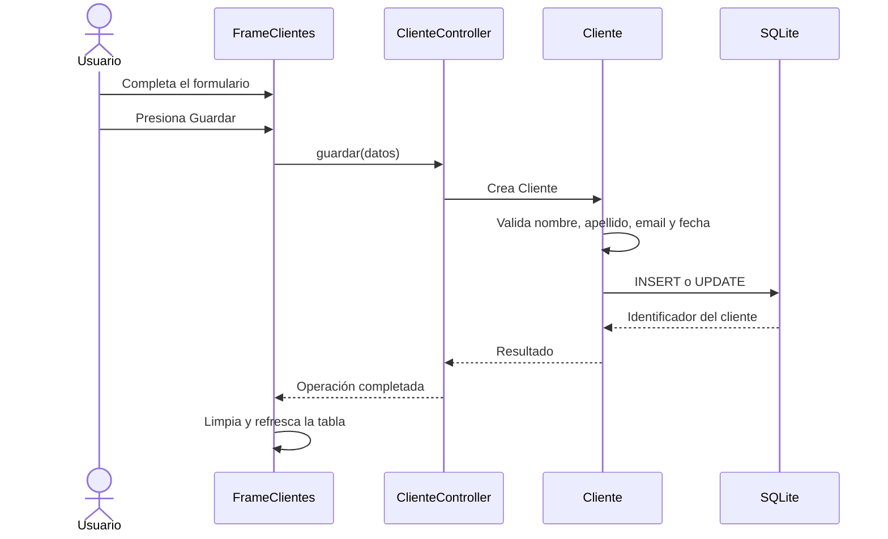
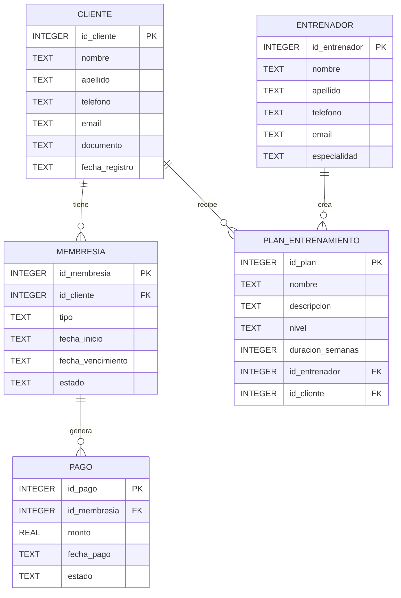

# Fitness Plus

Sistema de gestión para un gimnasio, desarrollado como una aplicación de escritorio. Permite administrar clientes, entrenadores, membresías, pagos y planes de entrenamiento desde una interfaz gráfica.

El proyecto utiliza una arquitectura **MVC (Modelo-Vista-Controlador)** para separar la interfaz, los casos de uso y la persistencia de datos.

## ¿Qué es?

Fitness Plus centraliza las operaciones principales de un gimnasio:

- Registro, edición, búsqueda y eliminación de clientes.
- Registro, edición, búsqueda y eliminación de entrenadores.
- Creación, edición, renovación, cancelación y eliminación de membresías.
- Registro, edición y eliminación de pagos.
- Creación y administración de planes de entrenamiento.
- Reportes de membresías próximas a vencer, membresías vencidas y pagos pendientes.
- Consulta del historial de un cliente: membresías, pagos y planes asignados.

La información se almacena localmente en una base de datos SQLite llamada `fitness_plus.db`.

## Stack tecnológico

| Tecnología | Uso |
|---|---|
| Python 3 | Lenguaje principal de la aplicación. |
| Tkinter | Interfaz gráfica de escritorio. |
| `ttk` | Componentes visuales nativos con estilos mejorados. |
| SQLite | Base de datos local y persistencia de información. |
| `sqlite3` | Módulo estándar de Python para conectarse con SQLite. |
| MVC | Patrón arquitectónico para separar responsabilidades. |
| Mermaid | Diagramas incluidos en la documentación Markdown. |

No se requieren paquetes externos para ejecutar el proyecto. `tkinter` y `sqlite3` forman parte de la distribución estándar de Python, aunque Tkinter debe estar incluido en la instalación de Python.

## Arquitectura MVC

La aplicación se divide en tres capas principales:



### Modelo

La carpeta `models/` contiene las entidades del dominio y sus reglas de validación:

- `Persona`: clase base para clientes y entrenadores.
- `Cliente`: datos y operaciones de los clientes.
- `Entrenador`: datos y operaciones de los entrenadores.
- `Membresia`: tipos, valores, fechas, estados, renovación y cancelación.
- `Pago`: monto, fecha y estado de los pagos.
- `PlanEntrenamiento`: relación entre un cliente y un entrenador.

Los modelos utilizan `data/database.py` para guardar y consultar información en SQLite.

### Vista

La carpeta `gui/` contiene las ventanas y componentes Tkinter:

- `VentanaPrincipal`: ventana raíz y menú lateral.
- `FrameClientes`: gestión de clientes.
- `FrameEntrenadores`: gestión de entrenadores.
- `FrameMembresias`: gestión del ciclo de vida de membresías.
- `FramePagos`: gestión de pagos.
- `FramePlanes`: gestión de planes de entrenamiento.
- `FrameReportes`: consultas y reportes.

Las vistas se encargan de mostrar formularios, tablas, mensajes y controles visuales. Las operaciones de negocio se delegan a los controladores.

### Controlador

La carpeta `controllers/` contiene los casos de uso que conectan la vista con el modelo:

- `ClienteController`
- `EntrenadorController`
- `MembresiaController`
- `PagoController`
- `PlanController`
- `ReporteController`

Los controladores se crean en `VentanaPrincipal` y se inyectan en las vistas. Esto reduce el acoplamiento y facilita probar o cambiar cada capa por separado.

## Flujo de una operación

Por ejemplo, al guardar un cliente:



## Modelo de datos



## Estructura del proyecto

```text
Project-Thinker-/
├── app.py                         # Punto de entrada
├── fitness_plus.db               # Base SQLite generada localmente
├── controllers/                  # Casos de uso de la aplicación
│   ├── cliente_controller.py
│   ├── entrenador_controller.py
│   ├── membresia_controller.py
│   ├── pago_controller.py
│   ├── plan_controller.py
│   └── reporte_controller.py
├── data/                         # Conexión y esquema de base de datos
│   └── database.py
├── gui/                          # Vistas Tkinter
│   ├── ventana_principal.py
│   ├── frame_clientes.py
│   ├── frame_entrenadores.py
│   ├── frame_membresias.py
│   ├── frame_pagos.py
│   ├── frame_planes.py
│   └── frame_reportes.py
├── models/                       # Entidades y reglas de negocio
│   ├── persona.py
│   ├── cliente.py
│   ├── entrenador.py
│   ├── membresia.py
│   ├── pago.py
│   └── plan_entrenamiento.py
└── docs/                         # Documentación adicional
    ├── diagrama_clases.md
    ├── mer.md
    └── mockup.md
```

## Requisitos

- Windows, macOS o Linux.
- Python 3 instalado.
- Soporte de Tkinter incluido en Python.
- No se necesitan librerías externas.

La aplicación fue validada con Python 3.14 y utiliza únicamente módulos estándar.

## Cómo iniciar el proyecto

1. Abre PowerShell o una terminal.
2. Entra en la carpeta del proyecto:

```powershell
cd "C:\Users\MrDylan\Documents\Projects\Project-Thinker-"
```

3. Ejecuta la aplicación:

```powershell
py app.py
```

También puedes utilizar:

```powershell
python app.py
```

Al iniciar, el programa crea automáticamente las tablas necesarias en `fitness_plus.db` si todavía no existen.

## Ejecución desde VS Code

1. Abre la carpeta del proyecto en VS Code.
2. Abre `app.py`.
3. Presiona `F5` o selecciona **Run Python File**.

Asegúrate de que VS Code tenga seleccionado el intérprete de Python correcto.

## Validaciones y reglas principales

- Nombre y apellido son obligatorios para clientes y entrenadores.
- El correo electrónico debe contener un formato básico válido.
- Las fechas deben utilizar el formato `YYYY-MM-DD`.
- Los tipos de membresía disponibles son mensual, trimestral, semestral y anual.
- El valor y la fecha de vencimiento de una membresía se calculan según su tipo.
- Una membresía puede estar activa, vencida o cancelada.
- Un pago solo puede estar en estado `Pagado` o `Pendiente`.
- El monto de un pago no puede ser negativo.
- La duración de un plan debe ser un número entero mayor que cero.
- Los niveles disponibles para un plan son `Principiante`, `Intermedio` y `Avanzado`.
- Las claves foráneas de SQLite están activadas para mantener la integridad de las relaciones.

## Documentación adicional

- [Diagrama de clases](docs/diagrama_clases.md)
- [Modelo entidad-relación](docs/mer.md)
- [Mockups de la interfaz](docs/mockup.md)

## Base de datos

La ruta de la base de datos se define en `data/database.py` y apunta al archivo `fitness_plus.db` en la raíz del proyecto.

La función `inicializar_base_datos()` crea las tablas mediante `CREATE TABLE IF NOT EXISTS`, por lo que ejecutar la aplicación por primera vez no requiere una migración manual.

Para reiniciar completamente los datos durante desarrollo, cierra la aplicación y elimina `fitness_plus.db`. La aplicación volverá a crear una base vacía en el siguiente inicio.

## Solución de problemas

### `python` o `py` no se reconoce

Instala Python desde [python.org](https://www.python.org/downloads/) y activa la opción para agregar Python al PATH.

### Error relacionado con `_tkinter`

La instalación de Python no incluye Tkinter. Reinstala Python incluyendo Tcl/Tk y vuelve a ejecutar `py app.py`.

### La ventana no aparece

Verifica que el proceso siga ejecutándose y que estés iniciando la aplicación en un entorno con interfaz gráfica. Este proyecto es una aplicación de escritorio y no se ejecuta como una página web.
