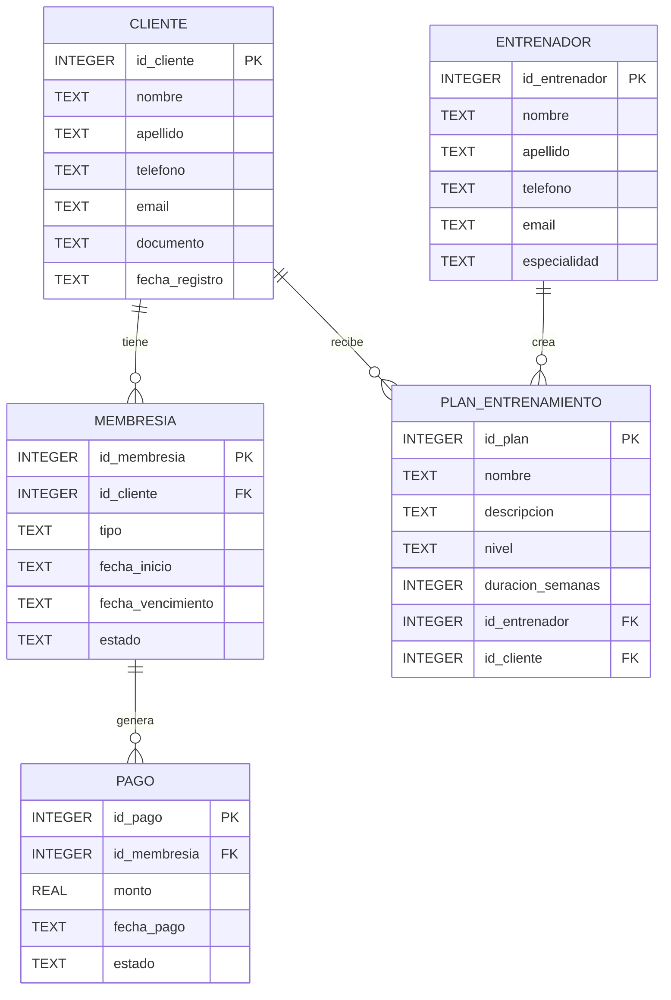

# Modelo Entidad-Relación — Fitness Plus

```mermaid
erDiagram
    CLIENTE {
        INTEGER id_cliente PK
        TEXT nombre
        TEXT apellido
        TEXT telefono
        TEXT email
        TEXT documento
        TEXT fecha_registro
    }
    ENTRENADOR {
        INTEGER id_entrenador PK
        TEXT nombre
        TEXT apellido
        TEXT telefono
        TEXT email
        TEXT especialidad
    }
    MEMBRESIA {
        INTEGER id_membresia PK
        INTEGER id_cliente FK
        TEXT tipo
        TEXT fecha_inicio
        TEXT fecha_vencimiento
        TEXT estado
    }
    PAGO {
        INTEGER id_pago PK
        INTEGER id_membresia FK
        REAL monto
        TEXT fecha_pago
        TEXT estado
    }
    PLAN_ENTRENAMIENTO {
        INTEGER id_plan PK
        TEXT nombre
        TEXT descripcion
        TEXT nivel
        INTEGER duracion_semanas
        INTEGER id_entrenador FK
        INTEGER id_cliente FK
    }

    CLIENTE ||--o{ MEMBRESIA : tiene
    CLIENTE ||--o{ PLAN_ENTRENAMIENTO : recibe
    ENTRENADOR ||--o{ PLAN_ENTRENAMIENTO : crea
    MEMBRESIA ||--o{ PAGO : genera
```